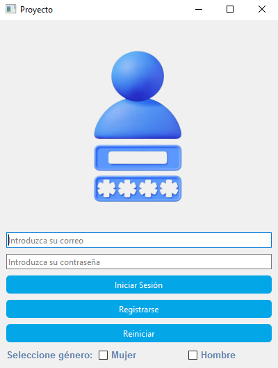
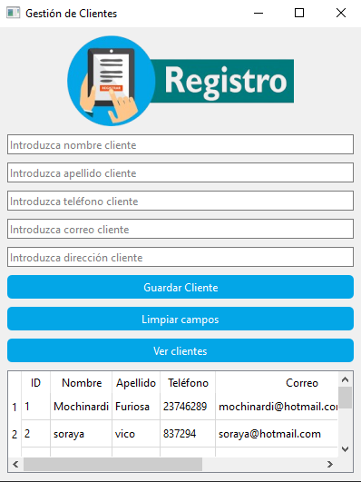

# Proyecto de Gestión de Usuarios y Clientes
## Por Soraya Núñez Vico

---

## Descripción

Este proyecto es una aplicación de escritorio desarrollada en Python utilizando **PySide6** y **SQLite** para la gestión de usuarios y clientes. Permite a los usuarios registrarse, iniciar sesión y administrar una base de datos de clientes de manera sencilla.

---

## Características

- Inicio de sesión y registro de usuarios con almacenamiento seguro en una base de datos _SQLite_.

- Interfaz gráfica intuitiva desarrollada con _PySide6._

- Gestión de clientes, incluyendo la capacidad de agregar, visualizar y limpiar registros.

- Persistencia de datos mediante SQLite.
---

## Tecnologías Utilizadas

- Python 3
- PySide6
- SQLite
---

# Instalación y ejecución

## Requisitos previos

Asegúrate de tener instalado:

- Python 3.x 

    - [Descargar Python](https://www.python.org/downloads/)


- PySide6
```sh
pip install PySide6
```

- SQLite
```sh
pip install sqlite3
```
---
## Ejecución del proyecto 

Clona este repositorio y ejecuta el archivo principal:

````sh
git clone https://github.com/SorayaBF13/proyecto-gestion.git
cd proyecto-gestion
python proyecto.py
````

---

## Estructura del proyecto

````
proyecto-gestion/
│── proyecto.py          # Interfaz principal de login y registro
│── clientes.py          # Ventana para la gestión de clientes
│── database.py          # Base de datos para usuarios
│── databaseClientes.py  # Base de datos para clientes
│── proyecto.db          # Archivo de base de datos SQLite
│── src/images/          # Imágenes utilizadas en la UI
│── README.md            # Documentación del proyecto
│── test_bbdd.py         # Pruebas del loggin
````

---

## Uso

1 - **Inicio de sesión o registro:** Un usuario debe registrarse con su correo y contraseña para acceder a la gestión de clientes.

2 - **Gestión de clientes:** Una vez autenticado, el usuario puede añadir nuevos clientes, ver la lista y limpiar campos.

3 - **Base de datos:** Todos los datos se almacenan en proyecto.db de forma persistente.

---

## Capturas de pantalla

### Loggin



---

### Control de clientes




---
